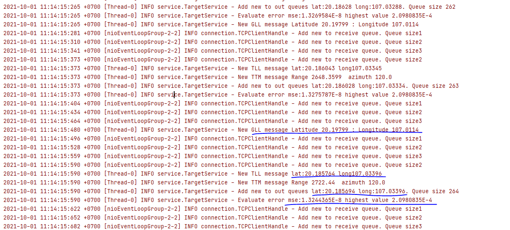

## Table of contents
* Info
* Build with
* Test result

## Info
* Project handle NMEA message of type $GPGLL and $TTM
  ~~~~
  $GPGLL is GPS message send position of ship in longitude and latitude. GPS info update immediately
  $TTM is message contain target position in distance and bearing
  $TLL is message contain target position in latitude and longtitude

* Calculate position of targets in WGS84 system before using cat34-48 to send. Targets in WGS84 was stored in outQueue.
* Message input protocol is TCP-IP. Messages was sent from TCP server with host and port value in application.properties. Changing config value in resources folder was applied when rebuild program or change value on file in targets folder without rebuild
* Longitude and latitude value was positive for position in North/East and negative for position in South/West
* Unit of input range is meter and input azimuth is degree
## Build with
~~~~
    * Language: java based on open-jdk 11
    * Environment: Ubuntu18-Bionic
    * Project managerment tool: Maven
    * Libraries : marine-api and geographiclib
~~~~
## Test result

* The result show that over 264 samples the MSE value of long,lat is **_1.3e-8_** when the highest value is only **_2.1e-4_**. 

	

